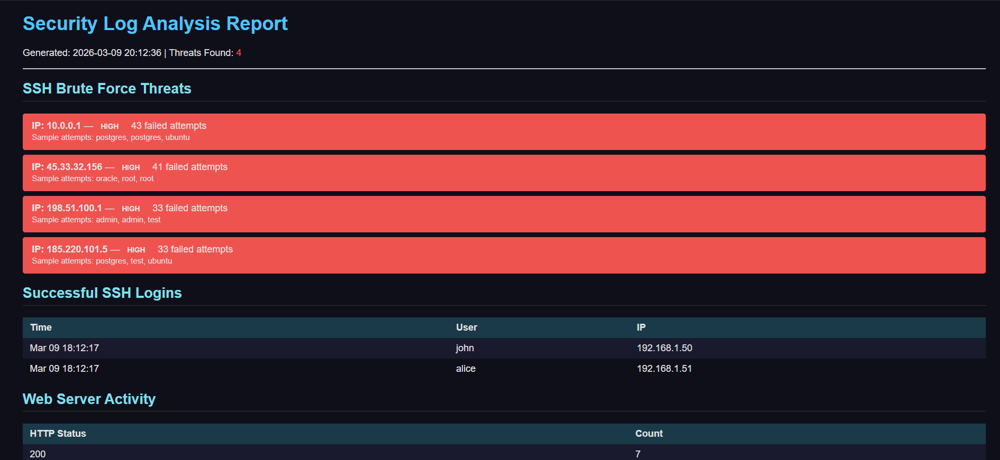
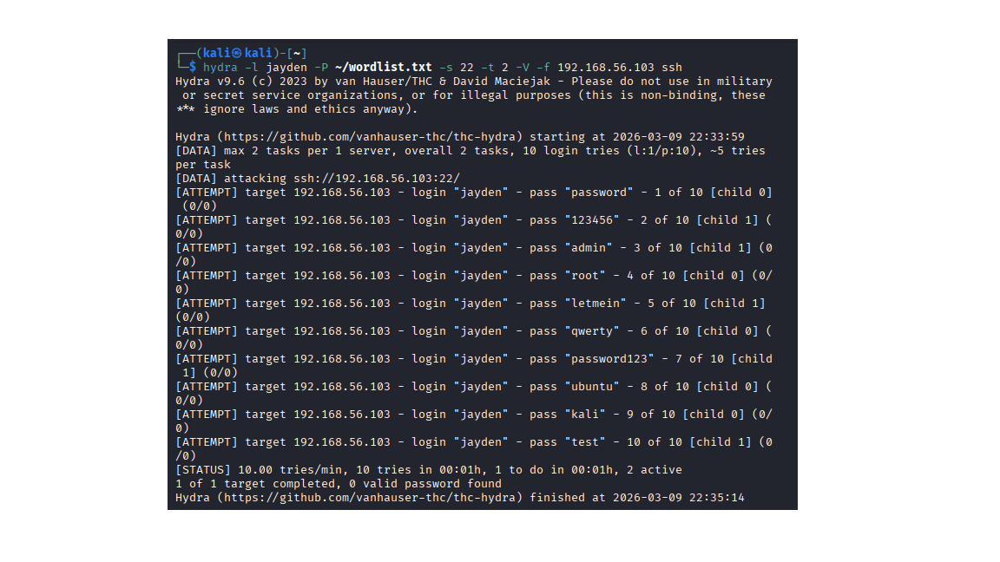
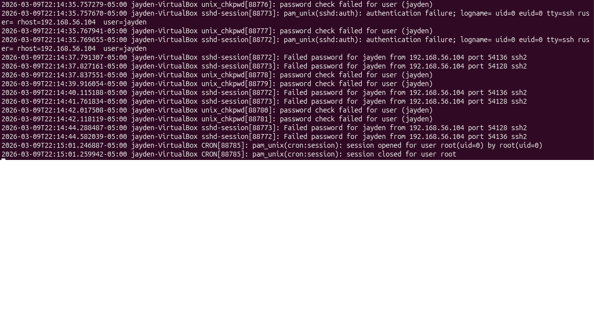
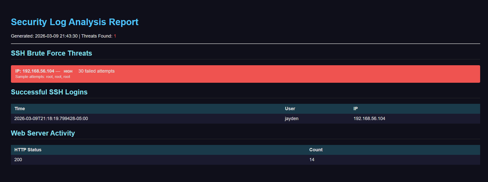

# Log Analyzer - Linux Security Tool

A Python-based security log analyzer built in an Ubuntu 22.04 VirtualBox lab.

## Preview


## Features
- SSH brute force detection with configurable thresholds
- Web server traffic analysis (Apache access logs)
- Suspicious path detection (admin pannells, config files)
- Automated HTML report generation
- Hourly scheduling via cron

## Built With
Python 3 | Bash | Linux | Apache | Virtualbox | Git

## How to Run
```bash
git clone https://github.com/YourUsername/log-analyzer.git
cd log-analyzer
sudo python3 log_analyzer.py
```
# Report generated at: report.html

## Lab Demo

### Attack - Hydra brute force running on Kali


### Ubuntu auth.log during the attack


### Detection - Analyzer report catching the attack
