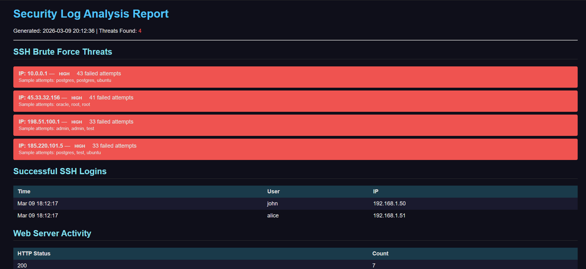
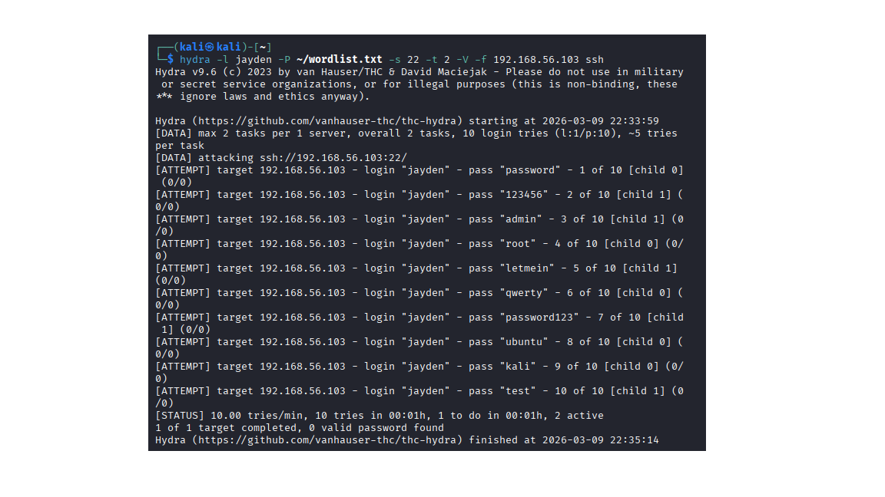
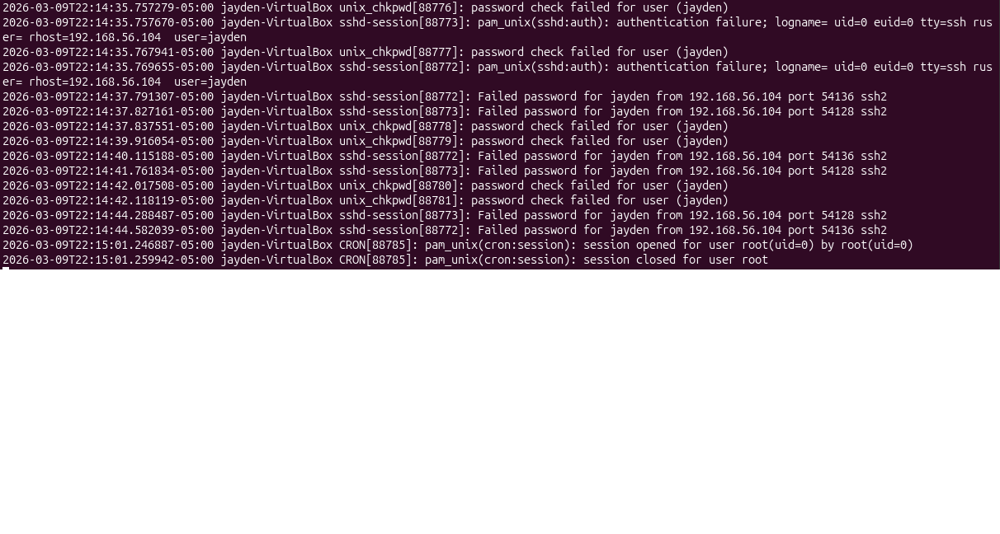
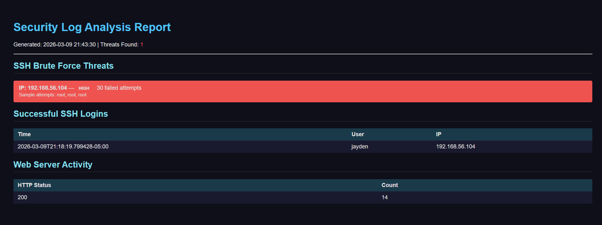

# Log Analyzer - Penetration Testing and Security Lab

A two-VM security lab built with VirtualBox where Kali Linux generates real attacks against an Ubuntu server, which are detected and reported by a custom Python log analyzer

## Preview


## Features
- SSH brute force detection with HIGH/MEDIUM severity ratings
- Real-time live watch mode ('--watch' flag)
- Web server traffic analysis and suspicious path detection
- Automated HTML report generation
- Hourly scheduling via cron, published through Apache

## Built With
Python 3 | Bash | Linux | Kali Linux | Apache | Virtualbox | Git

## Lab Setup
- **Attacker:** Kali Linux VM
- **Target:** Ubuntu Server 22.04 VM
- **Development:** VS Code Remote SSH connected to Ubuntu

## Attack Tools Used
- **Hydra** -- SSH brute force attacks
- **Nmap** -- Network reconaissance
- **Nikto** -- Web vulnerability scanning


## How to Run
```bash
git clone https://github.com/jayden-s22/log-analyzer.git
cd log-analyzer

# Standard analysis
sudo python3 log_analyzer.py

# Live watch mode
sudo python3 log_analyzer.py --watch
```
# Report generated at: report.html

## Lab Demo

### Attack - Hydra brute force running on Kali


### Ubuntu auth.log during the attack


### Detection - Analyzer report catching the attack

